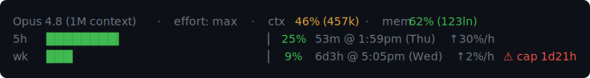

# quotaline

A Claude Code **status line** that shows your **official** account-wide usage limits — the
5-hour and weekly (7-day) windows — with a live burn rate and a warning when you're on track
to hit a cap before it resets. It reads only the data Claude Code already hands it: no tokens,
no API calls, no log scraping.



Plus an on-demand report (`quotaline report`) with an approximate **$ headroom** estimate.

## Why quotaline

- **Official, not estimated.** Most Claude usage trackers parse your local session logs
  (`~/.claude/projects/**`) and *estimate* how close you are to the limit against guessed
  plan caps. quotaline reads the real `rate_limits` object Claude Code pipes to status-line
  programs on **stdin** — the actual account-wide 5-hour and weekly percentages, not a guess.
- **Zero credentials, zero network.** It never reads your OAuth token, never calls
  `api.anthropic.com`, never scrapes claude.ai. Nothing to leak, no Terms-of-Service surface.
  (The other tools that show *official* limits get them by reusing your subscription token or
  driving a hidden browser session — quotaline needs neither.)
- **One line = your whole account.** The 5h/weekly limits are account-wide, shared across
  every session and surface, so a single status line already reflects your total.
- **One small binary.** A single ~400 KB native executable — no runtime, no dependencies, and
  it installs itself.

## What it shows

**Header** (each part shown only if Claude Code provides it):

- the model and current reasoning `effort` level;
- `ctx` — this session's context-window fill, coloured by absolute size (amber past 200k
  tokens, red past 500k), since that's what drives per-turn cost;
- `mem` — how full this project's `MEMORY.md` is (see [Memory gauge](#memory-gauge)).

**Two usage bars**, 5-hour and weekly, that grow to fill your terminal:

- a smooth sub-cell fill, green `< 80%` / amber `80–89%` / red `≥ 90%`, tracking the live
  value (so a reset drops it back to green);
- the time until that window resets (`53m`, `6d3h`);
- `↑X%/h` — the **burn rate**, a least-squares fit over recent samples within the current
  reset segment (so a reset never reads as negative burn);
- `⚠ cap <eta>` — shown **only** when, at the current rate, you'd hit 100% *before* the window
  resets. No warning means you'll reset before you run out.

Before your plan/session produces usage data, the line shows
`limits n/a (awaiting first API response)`.

### Memory gauge

`mem N% (Xln)` tracks the current project's `MEMORY.md` — the index Claude Code auto-loads
every session. Claude Code **head-truncates** it at **200 lines or 25,000 characters**
(whichever comes first), silently dropping the rest, so an oversized index means memory
stops loading. The gauge turns amber as you approach the cap (a 190-line / 23,500-char safety
margin) and red once it's truncating — your cue to trim or consolidate the index. Shown only
when the project has a `MEMORY.md`.

## Install

Requires a recent **Claude Code** (its status-line input must include `rate_limits`) and a
**Pro or Max** plan.

**macOS / Linux:**

```sh
curl -fsSL https://raw.githubusercontent.com/Entrolution/quotaline/main/install.sh | bash
```

**Windows (PowerShell):**

```powershell
irm https://raw.githubusercontent.com/Entrolution/quotaline/main/install.ps1 | iex
```

The script downloads the right prebuilt binary (into `~/.local/bin`, or
`%LOCALAPPDATA%\quotaline` on Windows) and runs `quotaline install`, which merges a
`statusLine` block into `~/.claude/settings.json` — backing it up first, preserving your
other settings, and refusing to touch the file if it isn't valid JSON. Start a new session
(or wait ~10s) and the line appears.

**From source** (needs a Rust toolchain):

```sh
git clone https://github.com/Entrolution/quotaline.git
cd quotaline
cargo build --release
./target/release/quotaline install
```

To remove it (also backs up first):

```sh
quotaline uninstall
```

## `quotaline report` — burn-rate & headroom

The status line appends a usage sample to `~/.claude/quotaline/usage-history.json` on each
render (throttled ~1/min). `report` reads that history and prints a fuller breakdown:

```sh
quotaline report               # uses the last ~2h for the rate
quotaline report --window 60   # use the last 60 minutes instead
```

```
Claude usage — burn rate  (42 samples over 3h12m)

  5h  ████░░░░░░░░░░   25%  +30.0%/hr   ETA 2h30m   resets in 53m  → resets first
      headroom ~$11.00   ($0.147/1%, ≈17,600 raw-tok/1%)

  wk  █░░░░░░░░░░░░░    9%  +2.0%/hr   ETA 1d21h   resets in 6d3h  → hits cap first
      headroom ~$200.20   ($2.200/1%, ≈264,000 raw-tok/1%)
```

The **% and ETA are exact**. The **`$` headroom is an estimate**: it anchors a "$ per 1%"
rate on the cost these Claude Code sessions burned, so usage elsewhere (claude.ai, other
tools) moves the percentage without showing up in the cost log. The 5h and weekly conversions
are computed separately, since the same spend moves the two windows by different amounts.
Treat the dollar figure as a ballpark.

## Configuration

`refreshInterval` (seconds, in the `statusLine` block) is how often the line re-renders even
when idle, so the countdowns tick. Set it at install with `quotaline install --refresh N`;
raise it to reduce churn.

Environment overrides:

- `CTT_STATE_DIR` — where the history lives (default `~/.claude/quotaline`).
- `CLAUDE_SETTINGS` — which settings file `install`/`uninstall` edit.
- `QUOTALINE_BIN_DIR` — where the install script puts the binary.

Colour thresholds, bar caps and the sampling/rate windows are compile-time constants at the
top of the `src` modules — change them and rebuild from source.

## How it works

Claude Code runs the `statusLine` command on each render and pipes a JSON object to it on
stdin. quotaline reads the fields it needs (`rate_limits`, `context_window`, `model`,
`effort`, `cost`, `transcript_path`), renders the lines, and — *after* flushing output, so it
can never delay your prompt — appends one usage sample to its history (throttled, pruned,
written via a per-process temp file + atomic rename). Every stage is wrapped so a failure
prints nothing rather than breaking your status line.

## Platforms

Prebuilt binaries for macOS (Apple Silicon + Intel), Linux (x86-64 + arm64) and Windows
(x86-64). Pure Rust standard library plus `serde` — no system dependencies.

## Notes & limits

- `rate_limits` is emitted only for **Pro/Max** accounts, and only **after the session's
  first API response**. Until then (or on a plan/version that doesn't send it) the line shows
  `limits n/a`. Each window can be independently absent.
- Anthropic doesn't publish the absolute token caps, so this shows **% of your allowance
  consumed**, not raw counts — which is the gauge you actually want.
- `~/.claude/quotaline/` holds per-machine history. Safe to delete; it just resets the
  burn-rate baseline.

## License

[MIT](LICENSE)
