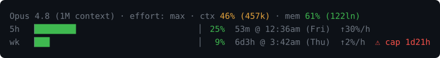

# quotaline

[](https://github.com/Entrolution/quotaline/actions/workflows/ci.yml)
[](https://github.com/Entrolution/quotaline/releases/latest)
[](LICENSE)


A Claude Code **status line** that shows your **official** account-wide usage limits — the
5-hour and weekly (7-day) windows — with a live burn rate and a warning when you're on track
to hit a cap before it resets. On **API-key (pay-as-you-go) billing**, where no limits exist,
it shows your **real dollar spend** instead — this session, today across sessions, and $/hour.
It reads only the data Claude Code already hands it: no tokens, no API calls, no log scraping.



Plus an on-demand report (`quotaline report`) with an approximate **$ headroom** estimate.

## Why quotaline

- **Official, not estimated.** Most Claude usage trackers parse your local session logs
  (`~/.claude/projects/**`) and *estimate* how close you are to the limit against guessed
  plan caps. quotaline reads the real `rate_limits` object Claude Code pipes to status-line
  programs on **stdin** — the actual account-wide 5-hour and weekly percentages, not a guess.
- **Zero credentials, zero network.** It never reads your OAuth token, never calls
  `api.anthropic.com`, never scrapes claude.ai. Nothing to leak, no Terms-of-Service surface.
  (The other tools that show *official* limits get them by reusing your subscription token or
  driving a hidden browser session — quotaline needs neither.)
- **One line = your whole account.** The 5h/weekly limits are account-wide, shared across
  every session and surface, so a single status line already reflects your total.
- **One small binary.** A single ~470 KB native executable — no runtime, no dependencies, and
  it installs itself.

## What it shows

**Header** (each part shown only if Claude Code provides it):

- the model and current reasoning `effort` level;
- `ctx` — this session's context-window fill, coloured by absolute size (amber past 200k
  tokens, red past 500k), since that's what drives per-turn cost;
- `mem` — how full this project's `MEMORY.md` is (see [Memory gauge](#memory-gauge)).

**Two usage bars**, 5-hour and weekly, that grow to fill your terminal:

- a smooth sub-cell fill, green `< 80%` / amber `80–89%` / red `≥ 90%`, tracking the live
  value (so a reset drops it back to green);
- the time until that window resets, with the local clock time it lands at
  (`53m @ 1:59pm (Thu)`, `6d3h @ 5:05pm (Wed)`);
- `↑X%/h` — the **burn rate**, a least-squares fit over recent samples within the current
  reset segment (so a reset never reads as negative burn);
- `⚠ cap <eta>` — shown **only** when, at the current rate, you'd hit 100% *before* the window
  resets. No warning means you'll reset before you run out.

Before your plan/session produces usage data, the line shows
`limits n/a (awaiting first API response)`. When the windows *stop* arriving for a session
that had been reporting them — a resumed session waiting on its first fresh response, or one
whose billing has changed — it reads `limits n/a (none reported for 12m)` instead, keeping
the header.

### API-key (pay-as-you-go) mode

With an organisational/API-key setup (`ANTHROPIC_API_KEY` or `apiKeyHelper`), Claude Code
never sends `rate_limits` — there is no account allowance to show. quotaline detects this
(a `cost` object, no `rate_limits`, real cost accrued) and switches to **dollars**:

- the **session's cost** joins the header (`… · ctx 7% (67k) · $1.81 · mem …`);
- a **`day` line** shows the machine's total spend **today** across all API-key sessions,
  the **`↑$X/h` burn rate**, and the time until the counter rolls over at local midnight:

  ```
  day  $12.40  4h50m @ 12:00am (Tue)  ↑$3.2/h
  ```

- set **`QUOTALINE_DAILY_BUDGET`** (USD, a plain number: `50`, not `$50`) and the day line
  becomes the familiar bar — % of budget with the green/amber/red bands, a `⚠ budget <eta>`
  warning when the current rate would hit the budget before midnight, and `⚠ over budget`
  once it's spent:

  ```
  day  ▕███████▌                      ▏ 25%  $12.40 of $50 · 4h50m @ 12:00am (Tue)  ↑$3.2/h
  ```

Unlike the subscription percentages (account-wide), the day figure covers **this machine's
Claude Code sessions only** — but it's your actual pay-as-you-go usage as Claude Code costs
it (list-price), not a guess against an unpublished cap. Subscription projects on the same
machine keep their bars: the two modes are detected per session, and API-key spend never
contaminates the subscription report's $-headroom anchor (nor vice versa).

### Memory gauge

`mem N% (Xln)` tracks the current project's `MEMORY.md` — the index Claude Code auto-loads
every session. Claude Code **head-truncates** it at **200 lines or 25,000 characters**
(whichever comes first), silently dropping the rest, so an oversized index means memory
stops loading. The gauge turns amber at **20,000 characters or 190 lines** and red once it's
truncating. That's your cue to trim or consolidate the index. Shown only when the project has
a `MEMORY.md`.

The 20,000 comes from the harness's own behaviour rather than a round number picked for
comfort. Claude Code nags after a write when the index is "approaching the 24.4KB read limit",
and across 13 of those firings the smallest reported size was 19.5KB, close to 80% of the cap.
The gauge is set to that point so it stops being green while the harness is already
complaining. Those firings only appear once an index is already over the line, so 19.5KB is an
upper bound on the real trigger rather than the trigger itself.

## Install

Requires a recent **Claude Code**: on a **Pro or Max** plan you get the limit bars (the
status-line input must include `rate_limits`); on **API-key billing** you get the
real-$ spend line instead.

**macOS / Linux:**

```sh
curl -fsSL https://raw.githubusercontent.com/Entrolution/quotaline/main/install.sh | bash
```

**Windows (PowerShell):**

```powershell
irm https://raw.githubusercontent.com/Entrolution/quotaline/main/install.ps1 | iex
```

The script downloads the right prebuilt binary (into `~/.local/bin`, or
`%LOCALAPPDATA%\quotaline` on Windows) and runs `quotaline install`, which merges a
`statusLine` block into `~/.claude/settings.json` — backing it up first, preserving your
other settings, and refusing to touch the file if it isn't valid JSON. Start a new session
(or wait ~10s) and the line appears.

**From source** (needs a Rust toolchain):

```sh
git clone https://github.com/Entrolution/quotaline.git
cd quotaline
cargo build --release
./target/release/quotaline install
```

To remove it (also backs up first):

```sh
quotaline uninstall
```

Release notes for each version are in [CHANGELOG.md](CHANGELOG.md).

## `quotaline report` — burn-rate & headroom

The status line appends a usage sample to `~/.claude/quotaline/usage-history.json` on each
render (throttled ~1/min). `report` reads that history and prints a fuller breakdown:

```sh
quotaline report               # uses the last ~2h for the rate
quotaline report --window 60   # use the last 60 minutes instead
```

```
Claude usage — burn rate  (42 samples over 3h12m)

  5h  ████░░░░░░░░░░   25%  +30.0%/hr   ETA 2h30m   resets in 53m @ 1:59pm (Thu)  → resets first
      headroom ~$11.00   ($0.147/1%, ≈17,600 raw-tok/1%)

  wk  █░░░░░░░░░░░░░    9%  +2.0%/hr   ETA 1d21h   resets in 6d3h @ 5:05pm (Wed)  → hits cap first
      headroom ~$200.20   ($2.200/1%, ≈264,000 raw-tok/1%)
```

The **% and ETA are exact**. The **`$` headroom is an estimate**: it anchors a "$ per 1%"
rate on the cost these Claude Code sessions burned, so usage elsewhere (claude.ai, other
tools) moves the percentage without showing up in the cost log. The 5h and weekly conversions
are computed separately, since the same spend moves the two windows by different amounts.
Treat the dollar figure as a ballpark.

When the history contains API-key spend from today, the report adds a **`day` section**
with the dollars spent, the recent $/hr rate, and — if `QUOTALINE_DAILY_BUDGET` is set —
whether you hit the budget or midnight first:

```
  day  $12.40 today (2 sessions)   +$3.2/hr   rolls over in 4h50m @ 12:00am (Tue)
      budget $50/day — 25% used → rolls over first
```

## Configuration

`refreshInterval` (seconds, in the `statusLine` block) is how often the line re-renders even
when idle, so the countdowns tick. Set it at install with `quotaline install --refresh N`;
raise it to reduce churn.

Environment overrides:

- `CTT_STATE_DIR` — where the history lives (default `~/.claude/quotaline`).
- `CLAUDE_SETTINGS` — which settings file `install`/`uninstall` edit.
- `QUOTALINE_BIN_DIR` — where the install script puts the binary.
- `QUOTALINE_DAILY_BUDGET` — USD/day; turns the API-key `day` line into a %-of-budget bar
  with a budget-ETA warning (no effect on subscription sessions).

Colour thresholds, bar caps and the sampling/rate windows are compile-time constants at the
top of the `src` modules — change them and rebuild from source.

## How it works

Claude Code runs the `statusLine` command on each render and pipes a JSON object to it on
stdin. quotaline reads the fields it needs (`rate_limits`, `context_window`, `model`,
`effort`, `cost`, `session_id`, `transcript_path`), renders the lines, and — *after* flushing output, so it
can never delay your prompt — appends one usage sample to its history (throttled, pruned,
written via a per-process temp file + atomic rename). Every stage is wrapped so a failure
prints nothing rather than breaking your status line.

## Platforms

Prebuilt binaries for macOS (Apple Silicon + Intel), Linux (x86-64 + arm64) and Windows
(x86-64). Pure Rust standard library plus `serde` — no system dependencies.

## Notes & limits

- `rate_limits` is emitted only for **Pro/Max** accounts. On a version that doesn't send it
  (and doesn't send `cost` either) the line shows `limits n/a`. Each window can be
  independently absent.
- API-key detection rests on `rate_limits` being absent (Claude Code provides no explicit
  billing-type field). On a Claude Code **too old to send `rate_limits` at all**, a
  subscription session is indistinguishable from an API-key one and shows the day line
  with its *estimated* session cost instead of bars — upgrade Claude Code to get the
  subscription view back.
- A session's billing can change **mid-life**: `--resume` reuses the session id, so a session
  started on a subscription can be resumed from a shell that exports `ANTHROPIC_API_KEY` and
  bill to the key from then on. quotaline keeps showing the waiting line until it has watched
  that session's cost climb for 45 minutes with no `rate_limits` arriving. The resume
  transient (cost restored, windows not yet repopulated) leaves the counter *frozen*, so it
  can never be mistaken for a switch however long the session idles, and the clock starts at
  the first climb rather than the first quiet sample. Spend during that wait isn't counted
  towards the day total, the same undercount-rather-than-guess bias as below.
- A single session's cost counter carries on through a change of billing, so a session that
  ran on an API key, moved to a subscription and came back is only ever charged for the
  movement *within* each API-key stretch — the climb across the subscription stretch is that
  plan's shadow estimate, and is discarded rather than guessed at.
- The API-key **day** total is reconstructed from quotaline's own sample history (which
  grows to ~25h of retention once API-key samples exist; subscription-only histories keep
  the original small file), so it only sees sessions rendered on this machine since the
  feature was installed — spend by other users of the same organisational key (or before
  install) doesn't appear. Spend that can't be *proven* to belong to today — a session's
  cost before its first logged sample, or a pre-existing session with no pre-midnight
  sample — is under-counted rather than guessed.
- Anthropic doesn't publish the absolute token caps, so this shows **% of your allowance
  consumed**, not raw counts — which is the gauge you actually want.
- `~/.claude/quotaline/` holds per-machine history. Safe to delete; it just resets the
  burn-rate baseline.

## License

[MIT](LICENSE)
